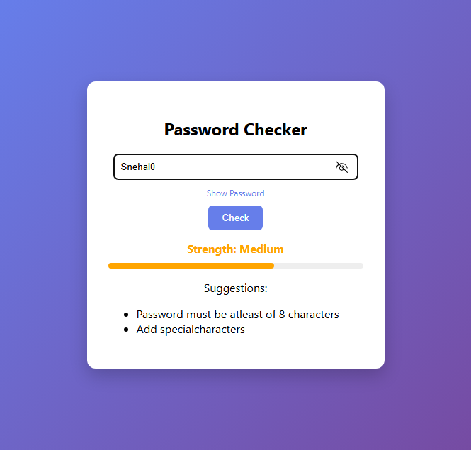

#  Password Strength Checker

A modern web application that evaluates the strength of a password and provides suggestions to improve its security.

This project is built using **Python (Flask)** for backend processing and **HTML, CSS, and JavaScript** for a responsive and interactive user interface.

---

##  Features

*  Password strength classification (Weak / Medium / Strong)
*  Validation based on:

  * Length (minimum 8 characters)
  * Uppercase & lowercase letters
  * Numbers
  * Special characters
* Suggestions to improve weak passwords
*  Show/Hide password functionality
*  Visual strength indicator (progress bar)
*  Clean and modern UI

##  Tech Stack

* **Backend:** Python (Flask)
* **Frontend:** HTML, CSS, JavaScript
* **Logic:** Regular Expressions (re module)

##  Project Screenshot

